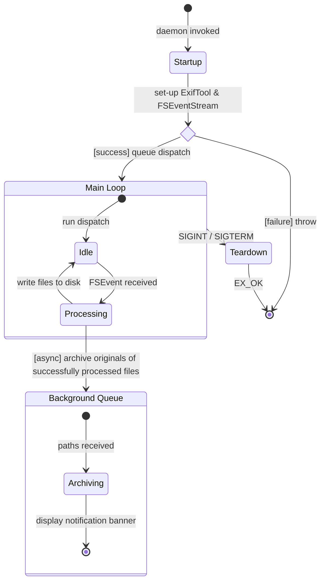
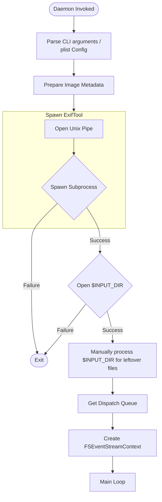
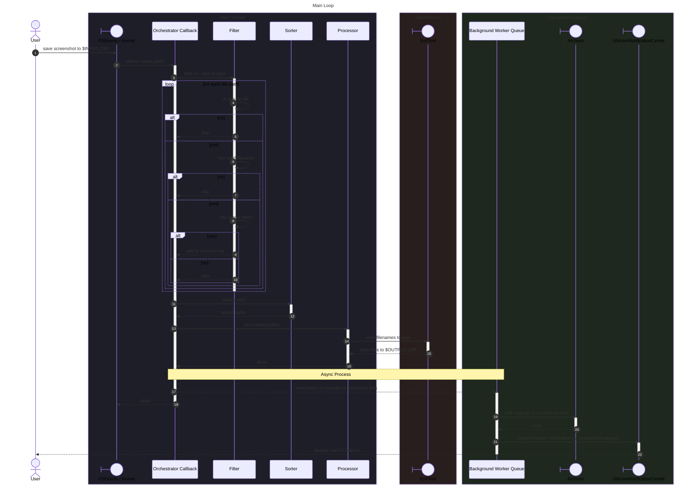

# sst (Screenshot Tagger)

## Operational Requirements

### Startup

1. Prepare configurations to pass to `ExifTool` and `FSEventStream`: e.g.: directory paths, image metadata
2. Spawn `ExifTool` as a persistent background process
3. Manually process `$INPUT_DIR` to clean up leftover files
4. Prepare the context needed by the callback function passed to `FSEventStream`
5. Prepare signal handlers for teardown
6. Attach the `FSeventStream` to the `dispatch_queue`
7. Run the main loop

### Main Loop

1. `FSEventStream` monitors `$INPUT_DIR`
2. `FSEvents` lists the paths of new files added to `$INPUT_DIR`
3. Filter regular files that do not start with '\_' (files still being written) nor '.'
4. Check files for magic bytes
5. Add the paths of valid files into a list
6. Sort the paths using natural sort
7. Send sorted paths to `ExifTool` for metadata injection and renaming
8. `ExifTool` sends the processed files to `$OUTPUT_DIR`
9. Archive the originals of successfully processed files; store in a monthly archive
10. `UNUserNotificationCenter` announces that $N$ screenshots were successfully processed

### Teardown

1. Capture interrupts
2. Stop and release `FSEventStream`
3. Manually process `$INPUT_DIR` to clean up leftover files
4. Close `ExifTool` and its spawned process

## Abstractions

1. `ExifTool` handler (piping, spawning)
2. `FSEventStream` handler (context creation, releaser)
3. `dispatch_queue` (enqueueing, dequeueing)
4. Signal handler (capturing interrupts)
5. Orchestrator callback function
6. Filter (checking name & magic bytes)
7. Sorter (natural sort)
8. Archiver (monthly archive)
9. `UNUserNotificationCenter` handler (banner)

## Component Specification

1. Photo metadata
   - input_dir : string
   - output_dir : string
   - arg_files_dir : string
   - artist : string
   - copyright : string
   - filename_regex : string
   - timezone : string
   - hardware_make : string
   - hardware_model : string
   - macOS_version : string

2. `ExifTool` handler
   - executable_path : string
   - is_running : bool
   - formatted_arg : string list
   - IPC_file_descriptors : integer pair
   - max_retries : integer

3. `FSEventStreamContext` handler
   - callback_function : Orchestrator callback
   - input_dir : string
   - input_dir_fd : integer
   - queue_handle : queue ptr
   - stream_handle : stream ptr
   - latency : float

4. `dispatch_queue`
   - queue_handle : queue

5. Signal handler
   - signals : integer list
   - queue_handle : queue
   - runtime_context : struct

6. Orchestrator (`FSEventStream` callback) function
   - input_dir : string
   - input_dir_fd : int
   - file_paths : string list
   - output_dir : string

7. Filter function
   - file_paths : string list
   - event_flags : integer
   - prefixes_to_ignore : string list | hardcoded checks
   - magic_bytes : bytes
   - max_retries : integer

8. Sorter function
   - file_paths : string list

9. Archiver function
   - file_paths : string list
   - archiver : executable / header
   - current_date : datetime / string
   - output_dir : string
   - max_retries : integer

10. `UNUserNotificationCenter` handler (function)
    - number_of_processed_originals : integer

## State Diagram



## Startup Flowchart



## Sequence Diagram



```mermaid
---
title: Teardown
---
sequenceDiagram
autonumber
```
