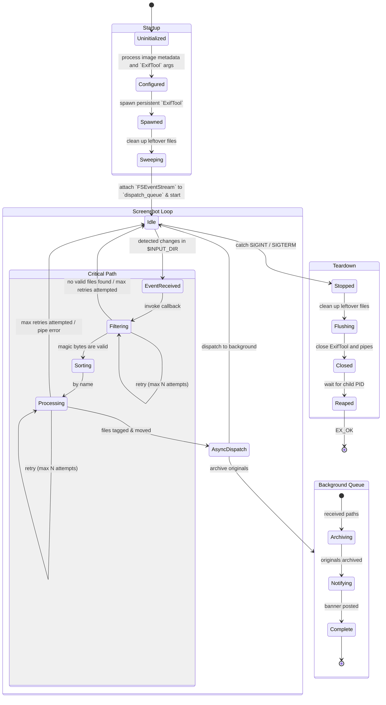
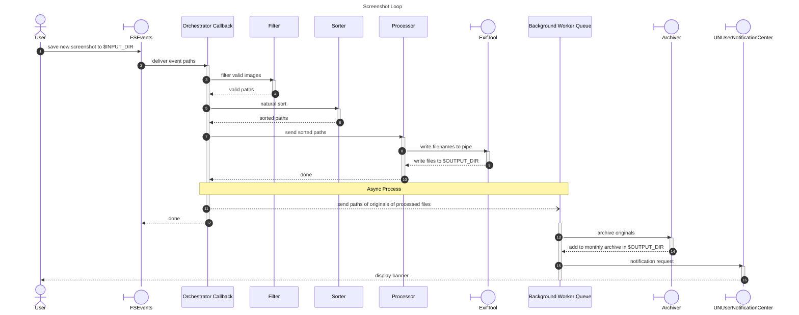

# sst (Screenshot Tagger)

## Functional Spec

### Startup

1. Prepare configurations to pass to `ExifTool` and `FSEventStream`: e.g.: directory paths, image metadata
2. Spawn `ExifTool` as a persistent background process
3. Manually process `$INPUT_DIR` to clean up leftover files
4. Prepare the context needed by the callback function passed to `FSEventStream`
5. Prepare signal handlers for teardown
6. Attach the `FSeventStream` to the `dispatch_queue`

### Main Loop

1. `FSEventStream` monitors `$INPUT_DIR`
2. `FSEvents` lists the paths of new files added to `$INPUT_DIR`
3. Filter regular files that do not start with '_' (files still being written) nor '.'
4. Check files for magic bytes
5. Add the absolute paths of valid files into a list
6. Sort the absolute paths using natural sort
7. Send sorted paths to `ExifTool` for metadata injection and renaming
8. `ExifTool` sends the processed files to `$OUTPUT_DIR`
9. Archive the originals of successfully processed files; store in a monthly archive
10. `UNUserNotificationCenter` announces that $N$ screenshots were successfully processed

### Teardown

1. Process interrupts
2. Stop and release `FSEventStream`
3. Manually process `$INPUT_DIR` to clean up leftover files
4. Close `ExifTool` and its spawned process

## Abstractions

1. `ExifTool` handler (spawning, piping, cleanup)
2. `FSEventStream` handler (context creation, releaser)
3. Filter (checking name & magic bytes)
4. Sorter (natural sort)
5. Archiver (add to monthly archive)
6. Orchestrator callback function
7. `dispatch_queue` (enqueuing, dequeuing)
8. `UNUserNotificationCenter` handler (banner)

## Attributes

1. `ExifTool` handler
    * executable path
    * running status
    * arguments list (e.g.: `$OUTPUT_DIR`)
    * IPC file descriptors
    * log file path

2. `FSEventStream` handler
    * `$INPUT_DIR`
    * stream handle
    * queue status
    * queue handle

3. Filter function
    * n/a

4. Sorter function
    * n/a

5. Archiver function
    * n/a

6. Orchestrator (`FSEventStream` callback) function
    * n/a

7. `dispatch_queue`
    * n/a

8. `UNUserNotificationCenter` handler (function/s?)

* n/a

## State Diagram

## Sequence Diagram

